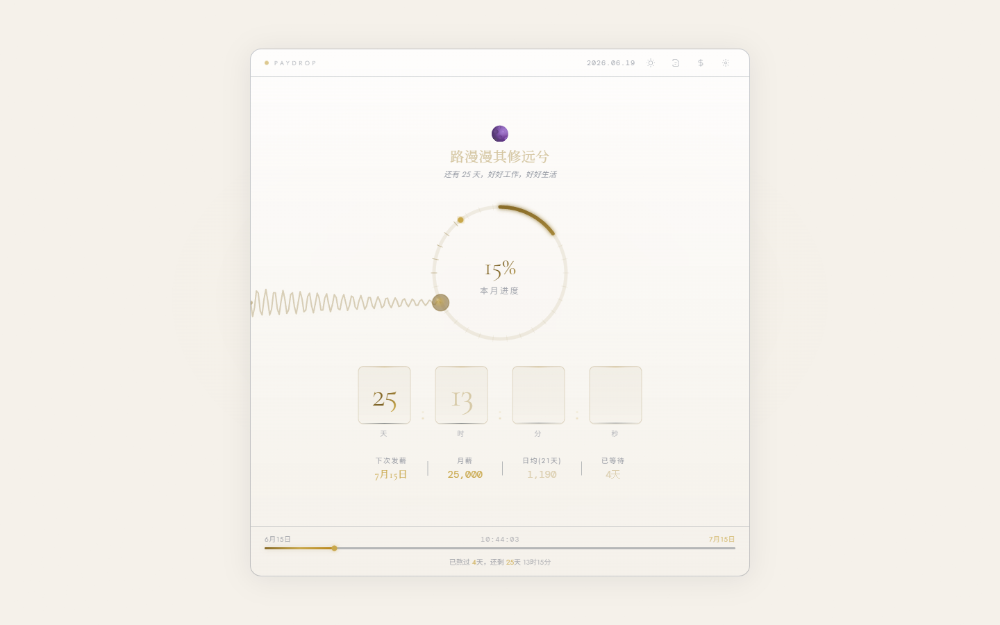

# 💰 PayDrop

**优雅的发薪日倒计时仪表盘** — 用精致的进度环、实时倒计时和日均工资计算器，可视化你离发薪日还有多远。

[](https://vuejs.org/)
[](https://vitejs.dev/)
[](https://tailwindcss.com/)
[](LICENSE)

[English](README.md)

> 每个月总有那么一天让人格外期待 — PayDrop 让等待变得更有趣。

## 功能特性

| 功能 | 说明 |
|---|---|
| **实时倒计时** | 天、时、分、秒多维度倒计时，带翻牌动画 |
| **进度环** | 金色渐变弧形进度环，直观展示本月薪资周期进度 |
| **实际工作日** | 接入中国法定节假日 API，按实际工作日计算日均薪资 |
| **裁员赔偿计算器** | 支持 N / N+1 / 2N 方案，依据《劳动合同法》第四十七条 |
| **薪资流水** | 记录与回顾每月薪资历史，本地存储 |
| **弹簧解压玩具** | Canvas 2D 弹簧物理模拟，拖拽即可解压 |
| **明暗双主题** | 一键切换 *Vault Noir*（暗金）与 *Ivory Dial*（象牙）主题，偏好自动持久化 |
| **响应式布局** | 移动端优先，桌面端居中悬浮卡片，两侧优雅留白 |
| **隐私优先** | 所有数据存储在 `localStorage`，不上传任何信息 |

## 预览

| 暗色 — *Vault Noir* | 亮色 — *Ivory Dial* |
|---|---|
|  |  |

## 快速开始

```bash
# 安装依赖
npm install

# 启动开发服务器
npm run dev

# 构建生产版本
npm run build
```

访问 `http://localhost:5173`，点击 **开始设置** 配置你的发薪日即可。

## 技术栈

| 技术 | 用途 |
|---|---|
| **Vue 3** | 响应式 UI 框架，使用 Composition API（`<script setup>`） |
| **Vite** | 极速开发服务器与构建工具 |
| **TailwindCSS** | 原子化 CSS，配合 CSS 变量实现主题切换 |
| **VueUse** | 组合式工具函数 — `useLocalStorage`、`useWindowSize` |
| **Canvas API** | 弹簧物理模拟渲染引擎 |
| **节假日 API** | [holiday-cn](https://github.com/NateScarlet/holiday-cn) 开源项目，通过 jsDelivr CDN 获取准确的工作日数据 |

## 项目结构

```
paydrop/
├── public/
│   ├── favicon.svg
│   └── icons.svg
├── src/
│   ├── components/
│   │   ├── CompensationModal.vue   # 裁员赔偿计算器
│   │   ├── CountdownBlock.vue      # 翻牌式倒计时数字
│   │   ├── ProgressRing.vue        # SVG 渐变进度环
│   │   ├── SalaryHistory.vue       # 薪资流水列表
│   │   ├── SetupModal.vue          # 发薪日与薪资配置
│   │   └── SpringToy.vue           # Canvas 弹簧物理玩具
│   ├── composables/
│   │   ├── useHoliday.js           # 节假日 API 请求与缓存
│   │   ├── usePayday.js            # 倒计时与薪资核心逻辑
│   │   └── useTheme.js             # 明暗主题切换
│   ├── App.vue                     # 根布局与组件编排
│   ├── main.js                     # 应用入口
│   └── style.css                   # 主题变量与全局样式
├── index.html
├── tailwind.config.js
├── vite.config.js
└── package.json
```

## 使用方式

1. **设置发薪日** — 选择每月发薪日期（1–28 号），可选填入月薪金额
2. **查看倒计时** — 进度环与计时器每秒更新
3. **了解日均** — 根据当月实际工作日数（排除周末和法定节假日）计算日均薪资
4. **探索工具** — 点击顶栏图标打开裁员赔偿计算器或薪资流水
5. **切换主题** — 点击太阳/月亮图标在明暗主题间切换

## 许可证

[MIT](LICENSE)
